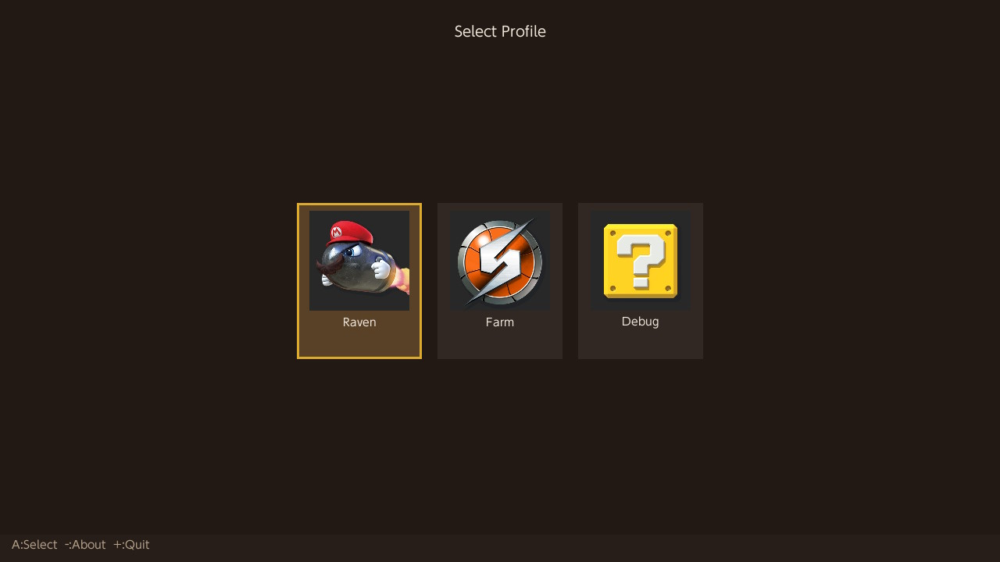
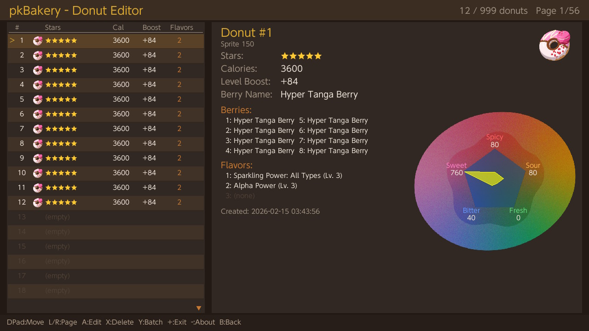
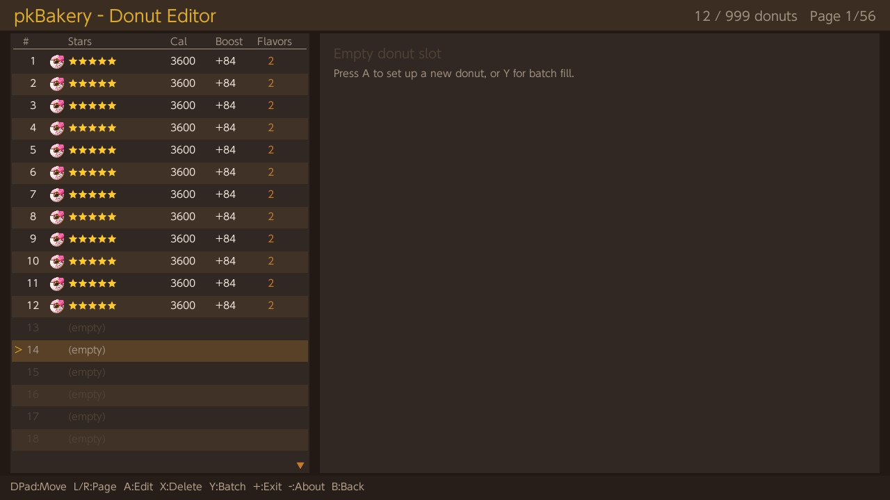
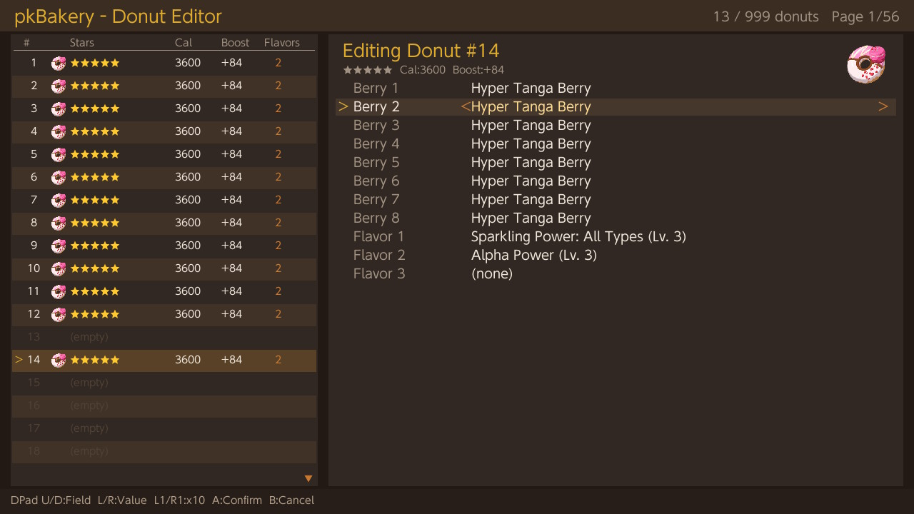
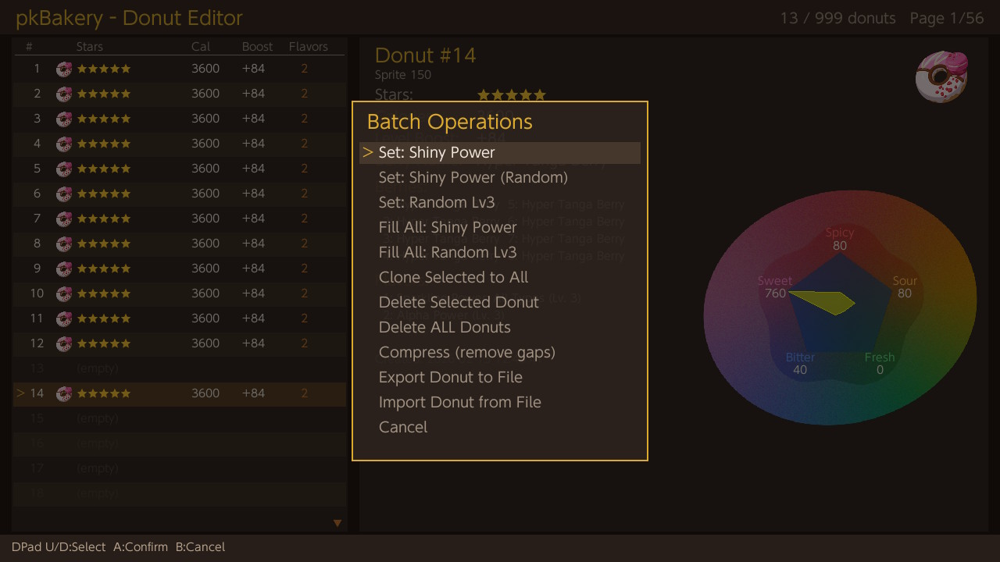
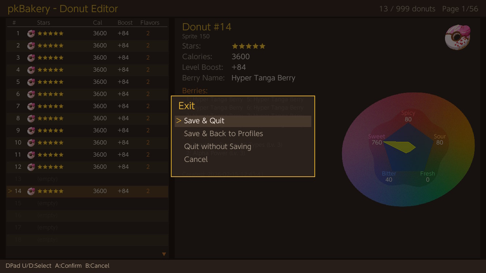

# pkBakery - Donut Editor

A Nintendo Switch homebrew application for editing donuts in Pokemon Legends: Z-A save files.

## Disclaimer

This software is provided "as-is" without any warranty.\
While the app has been tested, it may contain bugs that could corrupt or damage your save files.

**Use at your own risk.**

The author is not responsible for any data loss or damage to your save data.

**This is why the automatic backup system exists** — always verify your backups before making changes.

If you need to restore a backup, use a save manager such as [Checkpoint](https://github.com/FlagBrew/Checkpoint) or [JKSV](https://github.com/J-D-K/JKSV) to import the backup files back onto your Switch.

## Compatibility

- Legends Z-A version **2.0.1 only** !

## Features

### Save File Handling
- Reads and writes Pokemon Legends: Z-A save files using SCBlock encryption (SwishCrypto)
- Account-based profile selector — pick which Switch user's save to edit
- Automatic save backup before any modification (`backups/<profile>/<timestamp>/`)
- In-place file writing (`r+b`) to avoid Switch filesystem journal corruption
- Round-trip verification after load (encrypt(decrypt(file)) == file)
- Donut data accessed via SCBlock key `0xBE007476`

### Donut Editing
Each donut (72 bytes, up to 999 per save) has the following editable fields:

| Field | Description |
|-------|-------------|
| Berry 1-8 | 8 berry ingredients (66 valid berries) |
| Flavor 1-3 | Flavor effects (284 valid flavors, FNV-1a hashes) |

The following fields are **auto-calculated** from the berry ingredients:

| Field | Formula |
|-------|---------|
| Stars | From total flavor score of all berries (0-5) |
| Calories | Sum of berry calories x star multiplier `(10 + stars) / 10` |
| Level Boost | Sum of berry boosts x star multiplier `(10 + stars) / 10` |
| Berry Name | Set to Berry 1 |
| Sprite ID | Derived from berry donut index and dominant flavor variant |

Berry and flavor fields cycle through all valid values with L/R, or jump by 10 with L1/R1.

Empty slots auto-fill with a template donut (Sparkling Power: All Types Lv. 3 + Alpha Power Lv. 3) when entering edit mode.

### Donut Legality
All derived stats (Stars, Calories, Level Boost, Berry Name, Sprite) are enforced to match in-game calculations. The star-based multiplier formula `stat = sum * (10 + stars) / 10` was verified against in-game data across multiple berry combinations.

### Export / Import
- **Export** a donut to a `.donut` file in the app's `donuts/` folder
  - Filename is customizable via the Switch software keyboard, with a default based on berry name and star rating
  - Unsafe characters are stripped automatically
- **Import** a `.donut` file from the `donuts/` folder into the selected slot
  - Scrollable file picker with alphabetical sorting
  - Validates berry IDs, flavor hashes, and star rating before importing
  - Applies a fresh timestamp and recalculates stats after import
  - Delete `.donut` files directly from the import file picker (X button)

### Batch Operations
- **Set: Shiny Power** — Fill the current slot with a 5-star shiny donut (Sparkling Power: All Types Lv. 3 + Alpha Power Lv. 3)
- **Set: Shiny Power (Random)** — Fill the current slot with a 5-star shiny donut with randomized Sparkling Power, size effects, and Catch Power flavors
- **Set: Random Lv3** — Fill the current slot with random berries and 3 distinct random level-3 flavors
- **Fill All: Shiny Power** — Fill all 999 slots with 5-star shiny donuts with randomized Sparkling Power, size effects, and Catch Power flavors
- **Fill All: Random Lv3** — Fill all 999 slots with random berries and 3 distinct random level-3 flavors each
- **Clone Selected to All** — Copy the current donut to all 999 slots with unique timestamps
- **Delete Selected Donut** — Clear the current slot
- **Delete ALL Donuts** — Wipe all 999 slots
- **Compress** — Remove gaps by packing non-empty donuts to the front
- **Export Donut to File** — Export the selected donut
- **Import Donut from File** — Import a donut from file

### Flavor Radar Chart
The detail panel displays a radar chart showing the donut's flavor profile (Spicy, Fresh, Sweet, Bitter, Sour) with per-vertex scaling matching game's rendering.

## Controls

### Profile Selector

| Button | Action |
|--------|--------|
| D-Pad L/R | Navigate profiles |
| A | Select profile |
| - | About |
| + | Quit |

### Donut List

| Button | Action |
|--------|--------|
| D-Pad U/D | Move cursor |
| L1 / R1 | Page up / down |
| A | Edit selected donut |
| X | Delete selected donut |
| Y | Batch operations menu |
| + | Exit menu |
| - | About |
| B | Back to profile selector (with confirmation) |

### Edit Mode

| Button | Action |
|--------|--------|
| D-Pad U/D | Select field |
| D-Pad L/R | Adjust value +/-1 |
| L1 / R1 | Adjust value +/-10 |
| A or B | Return to list |

### Batch Menu / Exit Menu

| Button | Action |
|--------|--------|
| D-Pad U/D | Select option |
| A | Confirm |
| B | Cancel |

### Import File Picker

| Button | Action |
|--------|--------|
| D-Pad U/D | Select file |
| A | Import selected file |
| X | Delete selected file |
| B | Cancel |

### Exit Menu Options
- **Save & Quit** — Save changes and exit to home
- **Save & Back to Profiles** — Save changes and return to profile selector
- **Quit without Saving** — Exit without saving
- **Cancel** — Return to editor

## Donut9a Memory Layout

```
Offset  Size  Field
0x00    8     Timestamp (ms since 1970)
0x08    1     Stars
0x09    1     Level Boost
0x0A    2     Donut Sprite
0x0C    2     Calories
0x0E    2     Berry Name
0x10    16    Berry[8] (8 x uint16)
0x20    5     DateTime1900 (packed bitfield: year-1900, month, day, hour, minute, second)
0x25    3     (padding)
0x28    8     Flavor 1 (FNV-1a hash)
0x30    8     Flavor 2
0x38    8     Flavor 3
0x40    8     (reserved)
```

Total: 0x48 (72) bytes per donut, 999 max.

## Building

Requires [devkitPro](https://devkitpro.org/) with libnx, SDL2, SDL2_ttf, SDL2_image, and dmntcht.

```
export DEVKITPRO=/opt/devkitpro
make all
```

```bash
make clean
```

Produces `pkBakery.nro`. Place in `sdmc:/switch/pkBakery/` on your SD card.

## Screenshots

<div align="center">
  
  
  
  
  
  
  
  
</div>  

## Credits

- [PKHeX](https://github.com/kwsch/PKHeX) by kwsch — PokeCrypto research, SCBlock/SwishCrypto and donut structure reference
- [JKSV](https://github.com/J-D-K/JKSV) by J-D-K — Save backup and write logic reference
- Built with [libnx](https://github.com/switchbrew/libnx) and [SDL2](https://www.libsdl.org/)
